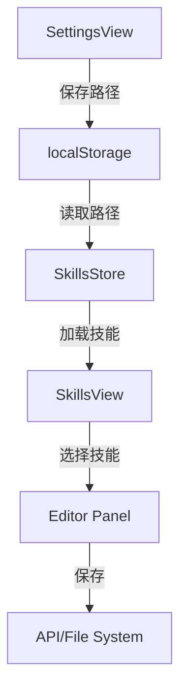

# Design Document: Skills View Optimization

## Overview

本设计文档描述技能库视图的优化方案，目标是简化界面结构、移除冗余功能、统一与MCP配置页面的视觉风格，并确保设置中的路径配置能正确同步到技能库视图。

设计遵循 Swiss Modernism 2.0 风格：简洁、模块化、清晰的层次结构。

## Architecture

### 组件结构

```
SkillsView.vue (主视图)
├── Header Section (标题 + 新建按钮)
├── Content Section
│   ├── Skills List Panel (左侧)
│   │   ├── Path Display (当前路径显示)
│   │   ├── Folder List (文件夹列表)
│   │   └── File List (文件列表)
│   └── Editor Panel (右侧)
│       ├── Editor Header (文件名 + 操作)
│       ├── Tab Switcher (编辑/预览)
│       └── Content Area (编辑器/预览)
└── Create Dialog (创建对话框)
```

### 数据流



## Components and Interfaces

### 1. SkillsStore 改进

```typescript
interface SkillsStore {
  // State
  skillsPaths: SkillPath[];        // 多路径支持
  activePathIndex: number;          // 当前激活的路径索引
  folders: SkillFolder[];
  files: SkillFile[];
  selectedSkill: SkillFile | null;
  loading: boolean;
  error: string | null;

  // Actions
  loadPathsFromStorage(): void;     // 从 localStorage 加载路径
  loadSkills(): Promise<void>;      // 加载技能列表
  selectSkill(skill: SkillFile): Promise<void>;
  saveSkill(skill: SkillFile, content: string): Promise<void>;
  createNewFile(fileName: string, content: string): Promise<string>;
  deleteItem(path: string): Promise<void>;
}

interface SkillPath {
  path: string;
  active: boolean;
}
```

### 2. SkillsView 组件结构

```vue
<template>
  <div class="skills-panel">
    <!-- 头部 - 与 McpView 风格一致 -->
    <div class="panel-header">
      <div class="header-content">
        <div>
          <h2 class="header-title">{{ t('skills.title') }}</h2>
          <p class="header-subtitle">{{ t('skills.subtitle') }}</p>
        </div>
        <button class="btn-add" @click="showCreateDialog = true" :disabled="!hasValidPath">
          <Plus class="btn-icon" />
          {{ t('skills.new') }}
        </button>
      </div>
    </div>

    <!-- 内容区域 -->
    <div class="skills-content">
      <!-- 左侧列表 -->
      <div class="skills-list">
        <!-- 路径显示 -->
        <div class="current-path-bar">...</div>
        <!-- 文件夹/文件列表 -->
        <div class="folder-tree">...</div>
      </div>

      <!-- 右侧编辑器 -->
      <div class="skills-editor">...</div>
    </div>
  </div>
</template>
```

### 3. 空状态组件

当没有配置路径时，显示引导用户去设置页面：

```vue
<div class="empty-state">
  <FolderOpen class="empty-icon" />
  <h3 class="empty-title">{{ t('skills.noFolder') }}</h3>
  <p class="empty-description">{{ t('skills.noFolderDesc') }}</p>
  <router-link to="/settings" class="btn-primary">
    <Settings class="btn-icon" />
    {{ t('skills.goToSettings') }}
  </router-link>
</div>
```

## Data Models

### localStorage 数据结构

```typescript
// Key: "skills_paths"
interface StoredSkillsPaths {
  paths: SkillPath[];
  lastUpdated: string;  // ISO timestamp
}

// 示例
{
  "paths": [
    { "path": "D:/skills/claude-code", "active": true },
    { "path": "D:/skills/mcp-configs", "active": true }
  ],
  "lastUpdated": "2026-01-08T10:00:00Z"
}
```

### 技能文件结构

```typescript
interface SkillFile {
  id: string;
  name: string;
  path: string;
  type: 'markdown' | 'json' | 'yaml';
  content: string;
  folderId: string | null;
}

interface SkillFolder {
  id: string;
  name: string;
  path: string;
  parentId: string | null;
  expanded: boolean;
}
```

## Correctness Properties

*A property is a characteristic or behavior that should hold true across all valid executions of a system-essentially, a formal statement about what the system should do. Properties serve as the bridge between human-readable specifications and machine-verifiable correctness guarantees.*

### Property 1: 路径配置持久化往返一致性 (Round-Trip)

*For any* valid skills path configuration, saving to localStorage and then reading back SHALL produce an equivalent configuration object.

**Validates: Requirements 1.1, 1.2**

### Property 2: 单一新建按钮约束

*For any* render state of Skills View (empty, loading, with data, error), there SHALL be at most one "new skill" button visible, and it SHALL be located in the header area only.

**Validates: Requirements 5.1, 5.2**

### Property 3: 技能内容显示一致性

*For any* skill file selected from the list, the editor panel SHALL display content that matches the skill's stored content property.

**Validates: Requirements 6.2**

## Error Handling

### 1. 路径不存在或无法访问

```typescript
if (!isPathAccessible(path)) {
  error.value = t('skills.pathNotAccessible', { path });
  // 显示重试按钮
}
```

### 2. API 不可用

```typescript
if (!isApiAvailable()) {
  // 使用 mock 数据或显示离线提示
  loadMockData();
}
```

### 3. 文件读取/写入失败

```typescript
try {
  await saveSkill(skill, content);
} catch (e) {
  toast.error(t('skills.saveFailed'));
}
```

## Testing Strategy

### Unit Tests

1. **SkillsStore 测试**
   - 测试 `loadPathsFromStorage` 正确读取 localStorage
   - 测试 `loadSkills` 在有效路径下加载文件列表
   - 测试空路径时的行为

2. **组件渲染测试**
   - 测试空状态正确渲染
   - 测试有数据时列表正确渲染
   - 测试选中状态样式

### Property-Based Tests

1. **路径同步属性测试**
   - 生成随机路径配置，验证 Settings 保存后 Skills View 能读取

2. **UI 状态一致性测试**
   - 验证任何状态下只有一个新建按钮

### Integration Tests

1. **Settings → Skills 流程测试**
   - 在 Settings 配置路径 → 导航到 Skills → 验证路径已加载

## UI Style Guidelines

### 与 McpView 保持一致的样式

```scss
// 头部样式
.panel-header {
  padding: var(--space-6);
  border-bottom: 1px solid var(--border);
  background-color: var(--card);
}

.header-title {
  font-size: 18px;
  font-weight: 600;
  color: var(--foreground);
}

.header-subtitle {
  font-size: 14px;
  color: var(--muted-foreground);
}

// 按钮样式
.btn-add {
  display: inline-flex;
  align-items: center;
  gap: var(--space-2);
  padding: 0 var(--space-4);
  height: 40px;
  background-color: var(--primary);
  color: var(--primary-foreground);
  border: none;
  border-radius: var(--radius-lg);
  font-size: 14px;
  font-weight: 500;
  cursor: pointer;
}

// 列表项样式
.skill-item {
  display: flex;
  align-items: center;
  gap: var(--space-2);
  padding: var(--space-2) var(--space-3);
  border-radius: var(--radius-md);
  cursor: pointer;
  transition: background-color 0.15s ease;
  
  &:hover {
    background-color: var(--accent);
  }
  
  &.active {
    background-color: oklch(0.65 0.22 270 / 0.1);
    color: var(--primary);
  }
}
```

### 移除的元素

1. ❌ 顶部搜索框
2. ❌ "技能浏览器" 标题
3. ❌ 文件夹选择按钮 (FolderSearch)
4. ❌ 文件夹浏览器对话框
5. ❌ 空状态中的"创建技能"按钮

### 保留的元素

1. ✅ 页面标题和副标题
2. ✅ 新建按钮（仅头部一个）
3. ✅ 当前路径显示条
4. ✅ 文件夹/文件树形列表
5. ✅ 右侧编辑器面板
6. ✅ 创建对话框
